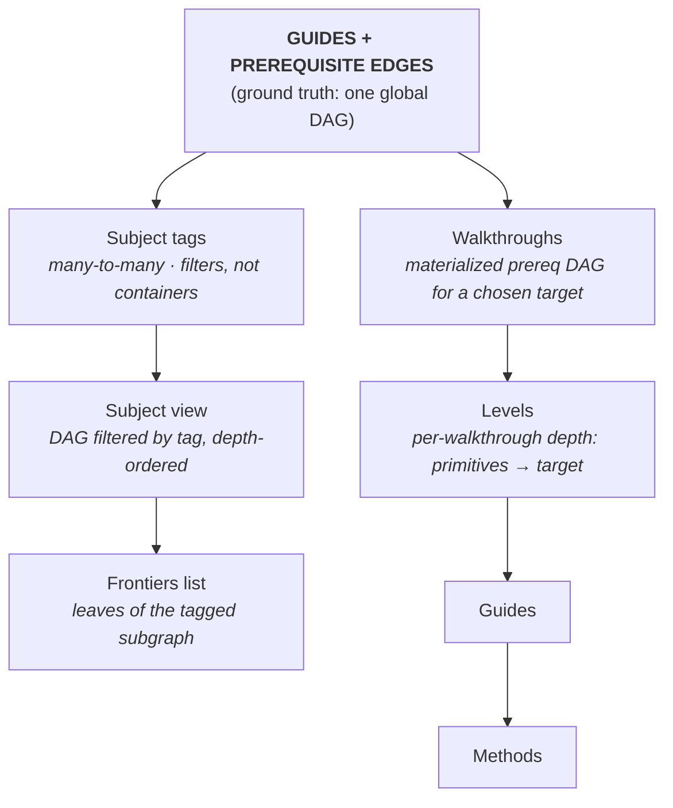
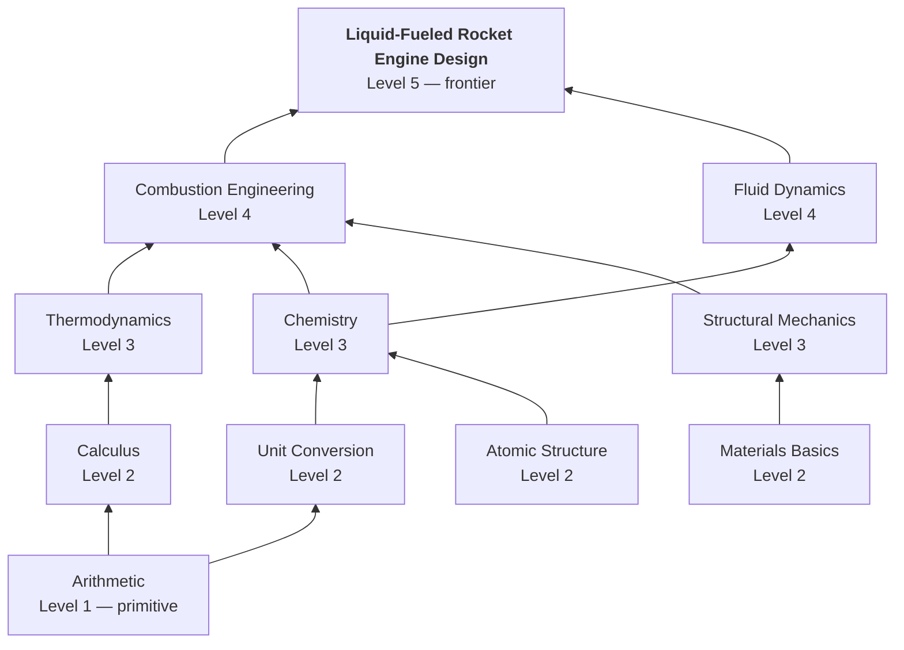

# Overall System

## Ground Truth: Guides + Prerequisite Edges

BLUE's underlying structure is a **directed acyclic graph (DAG)** of guides connected by prerequisite edges. Not a tree. Not a collection of separate hierarchies. One graph.

- A **guide** is a node.
- A **prerequisite edge** from A → B means "you must understand A before B."
- Subjects, walkthroughs, levels, and frontiers are **derived views** on top of this graph (not separate hierarchies stored alongside it).

This is what lets BLUE fit any kind of knowledge: a guide can have many prerequisites and many dependents, and the same guide can play different roles in different contexts (e.g. Quaternions = frontier of math, prerequisite of 3D animation).

## Terms

- **Guide**: The canonical how-to content unit for a single topic. Exactly one canonical guide per topic. A guide is a node in the global prerequisite graph. Low-level guides must be frontier-agnostic (cannot assume a specific end goal) so they remain reusable as prerequisites for many dependents (high-level guides can start to branch off and be more specific).
- **Prerequisite (prereq)**: For guide B, any guide with an edge into B is a prerequisite. With A → B, A is a prereq of B.
- **Dependent**: For guide A, any guide that requires A as a prereq is a dependent. With A → B, B is a dependent of A.
- **Subject**: A **tag** applied to guides (e.g. math, physics, vehicles). A guide can carry many subject tags. Subjects are not containers and do not own guides but rather filters/views over the global graph. A subject may declare a **prerequisite floor** (e.g. "physics subject floor = arithmetic + algebra") that applies to its tagged subgraph → you could technically just link up those prerequsite edges into the subject, but the idea of the floor is to keep the subject less bloated and prevent an infinite spiral of low-level dependencies.
- **Subject view**: The global graph filtered to guides carrying a given subject tag, rendered with depth ordering. This is what users browse when they "explore math." 
- **Frontier**: A **derived property**, not a declared one. A guide is a frontier *of subject S* if no other S-tagged guide depends on it (i.e. it is a leaf in the S-tagged subgraph). Frontier-ness is per-subject: the same guide can be a frontier in subject S and a prerequisite in subject T.
- **Walkthrough**: A materialized part of the graph: pick a target guide, compute its transitive prerequisite DAG, optionally filter by subject tag, render bottom-up. Most walkthroughs are auto-generated on demand from a chosen target. Users should also be able to save these walkthroughs locally.
- **Hierarchy**: The leveled shape of a walkthrough. Guides are grouped into levels where every guide at level N depends only on guides at levels below N. Guides at the same level are independent of each other and can be completed in any order.
- **Level**: A computed depth position within a walkthrough (level 1 = primitives with no prereqs in this walkthrough; highest level = frontier). The level of a guide = longest prerequisite path to it from a primitive in this walkthrough. Per-walkthrough only — the same guide can sit at different levels in different walkthroughs depending on what else is included.
- **Method**: An alternative approach to the same task inside a guide. Methods live inside their parent guide, each with its own page and URL. If a method becomes dominant via adoption, it can be promoted to the main guide content.
- **Modifications**: Edits to a guide or method.
- **Verifier**: A community member authorized to review guides and edits for a specific subject and level. New guides and edits are reviewed by an odd-numbered random jury of verifiers. Majority vote publishes; otherwise the guide returns to the author. Every vote requires a written justification.

## Discovery Flow

How a learner finds something to learn:

1. **Subject browse.** User picks a subject tag (e.g. "math"). System renders that subject's **frontiers list**, which is derived from the graph.
2. **Pick a frontier.** User picks a specific endpoint (e.g. "Quaternions," "Putnam-level Combinatorics").
3. **Walkthrough materializes.** System computes the prerequisite DAG from primitives up to that frontier, filtered by the subject context, and renders it as an ordered climb.
4. **Climb.** User works upward. Each guide shows its direct prereqs and direct dependents, plus its subject tags.

Users never see the whole graph at once (unless we later implement "Bird's Eye" which show all the hierarchies and guides on the entire site). The reader's screen always shows: one guide + a small neighborhood + its tags.

## Why Not a Single Big Tree

- A tree forces every guide to have one parent, which forces information to be under one subject. This would lead to many problems, as many frontiers require many subjects: cryptography sits between math and computer science; quaternions sit between math, physics, and 3D animation.
- Subject membership is many-to-many. The same guide should appear in every subject view it belongs to, without duplication.

## Why Not a Pure Graph With No Subjects

- Without subject tags, "explore math" or things alike have no entry point. 
- Subject tags allows an intuitive structure (browsing, frontiers list, scoped walkthroughs) without constraining guides to live in one place.

## Deduplication ("one canonical guide per topic")

Ways to prevent duplicate guides:

1. **Autocomplete search while writing a new guide title** (including synonyms): "Did you mean *X*?"
2. **A similarity warning at submit time** catches near-duplicates, even when titles are different.
3. **Verifier review before publish** includes a duplicate check, so duplicates can be rejected.

## Cross-Subject Conflicts

When two subjects both tag the same guide and their verifiers disagree on its content, the resolution is a **spin-off**: the guide forks into two subject-specific versions. This is an explicit, governed exception to "one canonical guide per topic," handled by the dispute system. See `open-questions.md` §7.2.

## Hierarchy (Conceptual)

Note: users will usually pick a target from the frontiers list and then materialize a walkthrough, but walkthrough generation is conceptually separate from the frontiers-list view.

## Walkthrough Hierarchy Structure Example

Here is a walkthrough example of liquid-fueled rocket engine design:

**Key constraints:**

- A guide at level N can only depend on guides at levels < N within the walkthrough. No forward references.
- Level numbers are computed from the DAG, not declared by authors. The level of a guide = longest prerequisite path to it from a primitive in this walkthrough.
- Multiple guides at the same level are independent of each other.
- Guides are shared. "Calculus" at level 2 of this walkthrough is the same node as "Calculus" in any other walkthrough that needs it. No duplication.
- The frontier is always the sole guide at the highest level. If a chosen target has multiple terminal dependents, the user is asked to pick one.

**Why this shape matters:**

Learners always know where they are. "I'm at level 3 of 5" is concrete. Each level is a clear milestone: complete all guides at level N, then all guides at level N+1 become unlocked. The hierarchy imposes order without being a rigid linear path — guides at the same level are parallel, not sequential.

---

*Still need to add guide creation/review sections*